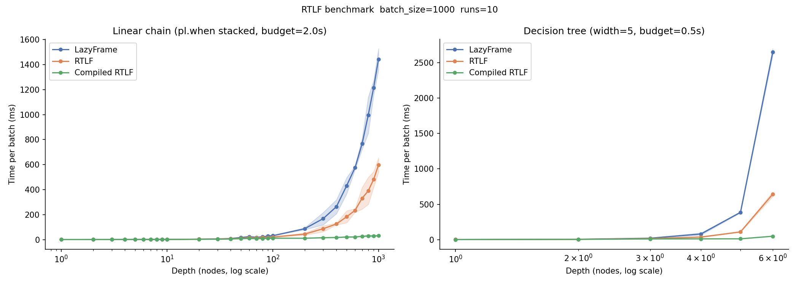
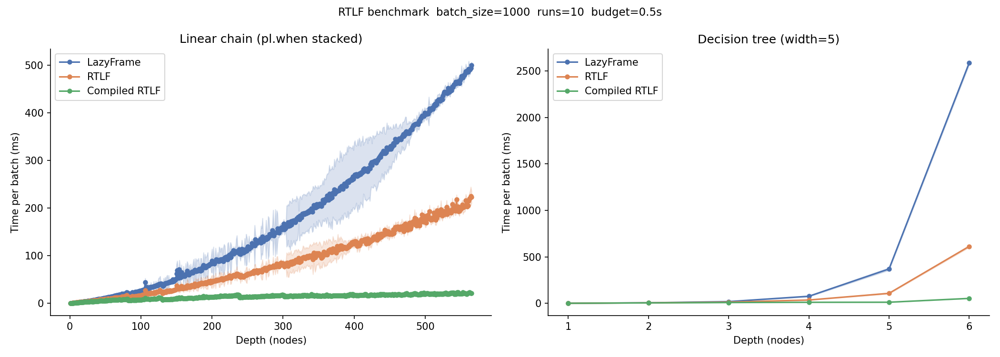

# polars-rt

A Rust extension for Polars that pre-compiles a lazy query plan once, then re-executes it at low latency by injecting new DataFrames at runtime — without re-running the optimizer.

> **Status:** experimental workaround for [pola-rs/polars#25246](https://github.com/pola-rs/polars/issues/25246). Currently tested on polars 1.38.1 only. The implementation relies on internal Polars APIs that may change without notice. Use with that in mind.

## The problem

Every call to `LazyFrame.collect()` runs the Polars optimizer from scratch. For a fixed expression (e.g. a decision tree or scoring function) applied to a stream of small batches, this optimization cost dominates execution time and grows super-linearly with plan complexity.

## How it works

There are two execution modes with different trade-offs.

### `RealtimeLazyFrame` — optimize once, re-compile physical plan each call

Runs the Polars optimizer once at construction and stores the resulting IR arena. Each `collect()` clones the arena, replaces placeholder scan nodes with `IR::DataFrameScan` nodes containing the supplied DataFrames, then calls `create_physical_plan` and executes. The optimizer is eliminated; the per-call cost is physical plan compilation plus execution.

### `CompiledRealtimeLazyFrame` — compile once, inject via slots

Produced by calling `.compile()` on a `RealtimeLazyFrame`. Runs `create_physical_plan` once and keeps the resulting executor tree alive between calls. Each `collect()` drops DataFrames directly into pre-wired `Arc<Mutex<Option<DataFrame>>>` slots that the placeholder executors hold references to — no plan recompilation, no arena clone. This is the fast path for high-frequency hot loops.

**Caution:** this path is only safe for a subset of queries. Polars physical executors are `&mut self` and several carry internal state that is consumed on first execution; re-running them on a second `collect()` call will panic or silently return wrong results. Use `RealtimeLazyFrame` (which rebuilds the physical plan on every call) if your query contains any of the following:

| Polars operation | Why it breaks on re-execution |
|---|---|
| `pl.concat` / `pl.DataFrame.vstack` | `Union` streaming executor uses one-shot channels that are drained on first run |
| `lf.join(..., how="cross")` | `CrossJoin` executor materialises the right side once and does not reset |
| `lf.join(..., how="asof")` | Stateful sort/merge step is not idempotent |
| Aggregations with `maintain_order=True` | Sort state may not reset between calls |
| `scan_parquet` / `scan_csv` / `scan_ipc` mixed into the plan | Real file scans use streaming file iterators; cursor is not rewound |

Operations that **are** safe to compile include: `select`, `with_columns`, `filter`, `group_by` (without `maintain_order`), `sort`, `rename`, `drop`, `explode`, `unnest`, `join` (inner/left/right between two placeholders or a placeholder and a literal in-memory frame), `struct` expressions, and `when/then/otherwise` chains. In practice `.compile()` works well for pure expression evaluation and scoring pipelines over placeholder inputs.

```python
import polars as pl
from rtlf import PyRealtimeLazyFrame

schema = pl.Schema({"feat_0": pl.Int32, "feat_1": pl.Int32})
expr = pl.when(pl.col("feat_0") < 5).then(pl.lit(1)).otherwise(pl.lit(0))

placeholder = PyRealtimeLazyFrame.read_placeholder("input", schema)
rtlf = PyRealtimeLazyFrame(placeholder.select(expr))

# Option A: re-compiles physical plan each call
for batch in stream:
    result = rtlf.collect({"input": batch})

# Option B: compile once, inject via slots (maximum speedup)
compiled = rtlf.compile()
for batch in stream:
    result = compiled.collect({"input": batch})
```

## Benchmarks

All benchmarks use batch size=1000 rows, 10 timed runs per depth point. Results show mean time and speedup relative to `LazyFrame.collect()`.

### Linear chain

A chain of stacked `pl.when(...).then(...).otherwise(...)` calls — depth is the number of nodes. This is the typical structure of a scoring function or feature pipeline.


```
depth_range    lf_ms     rtlf_ms  compiled_ms  rtlf_speedup  compiled_speedup
-------------------------------------------------------------------------------
1–9             1.24        1.25         0.95          0.99x             1.31x
10–99          12.93        9.57         5.78          1.35x             2.24x
100–999       502.97      216.92        21.52          2.32x            23.37x
1000          1545.78      670.64        38.64          2.30x            40.00x
```

At 100+ nodes, `CompiledRealtimeLazyFrame` is **23–40x faster** than plain `LazyFrame`. The optimizer cost grows super-linearly with plan depth; `rtlf` eliminates it entirely. Even the uncompiled `rtlf` gives 2.3x at scale. Note that 100+ node chains are uncommon in practice — for typical queries the gain is more modest.

### Decision tree

Width-5 branching tree (each depth level fans out 5 ways), so node count is exponential in depth.

```
depth     lf ms    rtlf ms  compiled ms  rtlf speedup  compiled speedup
------------------------------------------------------------------------
    1      1.419      1.413       0.946          1.00x             1.50x
    2      5.797      5.276       4.392          1.10x             1.32x
    3     20.482     15.234      10.153          1.34x             2.02x
    4     80.748     36.744      11.262          2.20x             7.17x
    5    386.197    109.837      11.886          3.52x            32.49x
    6   2651.983    643.382      48.658          4.12x            54.50x
```

Even at shallow depth the exponential node count makes optimizer overhead dominate. By depth 6, `CompiledRealtimeLazyFrame` is **54x faster** than plain `LazyFrame`. These numbers reflect a fairly extreme plan size — real-world decision trees are typically shallower and the speedup will be lower.

### Scaling results




### Running the benchmarks

```bash
uv sync
uv run maturin develop --release
source .venv/bin/activate
python benchmark.py
# outputs: benchmark.png, benchmark_linear.parquet, benchmark_tree.parquet
```

## Building

Requires:
- Rust nightly (`nightly-2026-01-09`) — set via `rustup override set nightly-2026-01-09` in `rtlf/`
- Python ≥ 3.12, `uv`

```bash
cd rtlf
uv sync
uv run maturin develop --release
```

## Implementation notes

### Placeholder mechanism (`src/realtime.rs`)

There is no clean public API in `create_physical_plan` for injecting custom data sources, so placeholders are disguised as real Parquet scans. `read_placeholder()` constructs a `DslPlan::Scan` with two sentinel path tokens: `_rtlf::placeholder` (the marker) and the placeholder name. The optimizer treats this as an ordinary file scan and optimizes around it normally.

At construction time, `RealtimeLazyFrame::new()` runs the optimizer and walks the resulting IR arena to record the node index of each placeholder scan. On `collect()`, these nodes are patched to `IR::DataFrameScan` in a cloned arena before `create_physical_plan` is called.

### Compiled slot injection (`src/compiled.rs`, `src/executor.rs`)

`CompiledRealtimeLazyFrame` reuses the same physical executor tree across calls. The key problem is how to get fresh DataFrames into an already-compiled tree without rebuilding it.

The approach uses `StreamingExecutorBuilder` — a function-pointer hook that `create_physical_plan` calls when it encounters a scan node. By passing `placeholder_builder` as this hook, the compiled path intercepts placeholder scans during the single up-front compilation, replacing each one with a `PlaceholderExec` that holds a `Slot` (`Arc<Mutex<Option<DataFrame>>>`). The slot references are also stored in `CompiledRealtimeLazyFrame`. On each `collect()`, DataFrames are moved into the slots then the executor runs — no arena clone, no plan recompilation.

An earlier approach routed DataFrames through the `ExecutionState` cache (the standard Polars mechanism for pre-computed frames). This worked but was measurably slower than the slot approach because the cache involves additional indirection and allocation on the hot path.

### Caveats

This library is experimental and works well for a limited set of use cases. Known constraints:
- The `StreamingExecutorBuilder` hook is only called for scan nodes, so queries that involve non-placeholder file scans (e.g. a join against a real Parquet file) go through the normal path and are handled by `RealtimeLazyFrame` rather than the compiled path.
- The placeholder detection relies on a specific path format inside `IR::Scan`. Any internal polars refactor that changes how scan sources are stored could break it.
- Concurrent `collect()` calls on a single `CompiledRealtimeLazyFrame` are serialised by a mutex on the physical executor. The executor tree cannot be cloned (polars `Executor` does not implement `Clone`), so true parallelism requires one `CompiledRealtimeLazyFrame` per thread — call `.compile()` once per thread at startup. Depending on thread count and plan complexity, this may actually be faster than sharing a single instance with lock contention.

### Source files

- **`src/realtime.rs`** — `RealtimeLazyFrame`: optimizer-once, re-compile-physical-plan-each-call path
- **`src/compiled.rs`** — `CompiledRealtimeLazyFrame`: compile-once, slot-injection path
- **`src/executor.rs`** — `PlaceholderExec`, `Slot` type, `placeholder_builder` hook, placeholder node detection
- **`src/python/`** — pyo3 wrappers; GIL released via `py.detach()` during `collect()`
- **`src/error.rs`** — `PolarsError` → Python exception mapping (orphan rule workaround)

### Version pinning

`DSL_SCHEMA_HASH` is a SHA256 of the Polars plan type definitions baked into the compiled `.so` at build time. It must match exactly between the extension and the installed Python polars wheel. Crates.io published versions do not correspond to any Python release tag, so all polars crates are patched via `[patch.crates-io]` to the `py-1.38.1` git tag of the polars monorepo. Building against any other source will produce a hash mismatch at runtime.
